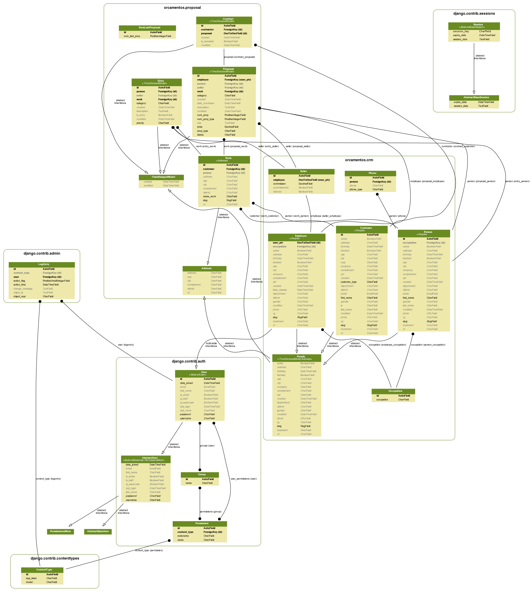

É um sistema para controle de orçamentos.

# Orçamento

Controla a sequência numérica dos orçamentos. Significa que cada orçamento terá um número sequencial, mas cada orçamento pode ter uma revisão. Uma revisão de orçamento significa que ele foi alterado mas se manteve o original (com seu valor original), exemplo:

Orc 001.15.0 | R$ 3.700,00

Orc 001.15.1 | R$ 3.200,00

O orçamento tem o mesmo número, mas o que define a revisão é o número 0, 1, 2, 3, ... no final no número.

A revisão é numérica, mas se um cliente quiser a revisão por letra, então seria:

Orc 001.15.A | R$ 3.700,00

Orc 001.15.B | R$ 3.200,00

Mas dai temos o limite de 26 revisões por orçamento. Mas por enquanto, vamos ficar com a revisão numérica mesmo.

Mas cada novo orçamento terá sua nova numeração:

001.15.0

002.15.0

003.15.0

004.15.0

...

Um orçamento tem uma *obra*, um *contato*, um *funcionário* (que é o orçamentista) e um *seller* (vendedor).


# Cliente

Podemos cadastrar os clientes, obras e contatos.

Repare na modelagem que cada cliente pode ter várias obras (OneToMany).

Cada *cliente* também tem um *contato* (pessoa).


# Obra

Cada *obra* tem um *contato* e pertence a um *cliente*.


# Funcionário

Cada *funcionário* pode ser um *vendedor* (OneToMany).

**Não** haverá lista de funcionário, pois o mesmo estará somente no *Admin*.

# Entrada

A entrada é como se fosse uma tarefa (pendente), significa que um orçamento foi cadastrado e está pronto para ser feito. Quando alguém pega-lo pra fazer será dado baixa na entrada e o novo orçamento terá uma nova numeração.

Sendo assim, os campos *obra*, *contato*, *funcionário* e *vendedor* serão copiados para o novo orçamento.


# Cadastro rápido

É um formulário onde todas as tabelas serão gravadas e sincronizadas...

Válido somente para *obras* **novas**.

Requer JavaScript


## Gráficos do modelo

```bash
sudo apt-get install graphviz libgraphviz-dev pkg-config
pip install pygraphviz
git clone https://github.com/nlhepler/pydot
cd pydot
python setup.py install
cd ..
rm -rf pydot
pip install django-extensions
pip install pyparsing
```

Para gerar o gráfico

```bash
./manage.py graph_models -a -g -o dev/orcamentos.png
```


